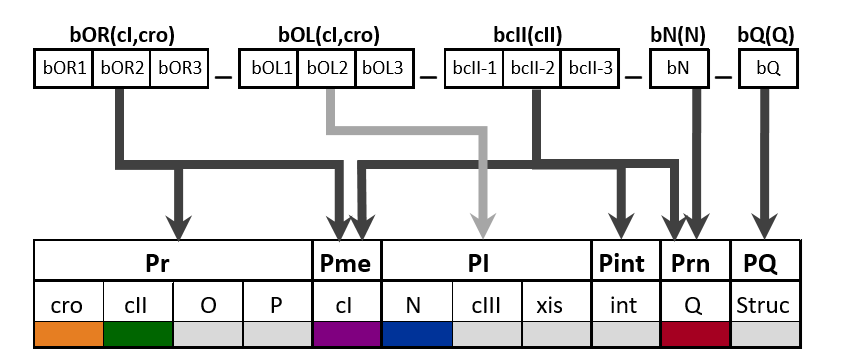

# Hybrid system modelling framework HSM

HSM modelling framework [1] is a type hybrid system based modelling formalist that is specially adapted for description and analysis of biomolecular networks. 
HSM is designed to include to be as simple as possible to facilitate model analysis and still to provide sufficient modelling power for accurate descriptions of biological systems. 

A standing-out feature of HSM approach is that it allows differentiating between quantitative and qualitative behavioural aspects of the modelled system. Using this approach gene regulatory network is 
regarded to be fully defined by HSM with concrete model-specific functions describing variable changes and thresholds triggering state transitions. At the same time, the knowledge about the 
underlying HSM is assumed to be limited and the initial models are given by HSM frames that include only discrete information about comparative values of HSM parameters (such as growth rates of 
functions or triggering thresholds) chosen to correspond to experimentally derived or generally assumed facts about the modelled biologic al system. If reachability of states in state space of the 
initial HSM frame depends on additional comparative relations between the model parameters, these are iteratively added as additional constraints in frame refinements until all the constraints on the 
parameters affecting the state reachability have been derived. One of the first HSM models LPH1 [2] has been designed lambda phage virus and allowed to derive biological hypotheses on binding site affinities 
that are required for model dynamic behaviour to be consistent with known observational facts, and which in principle are experimentally verifiable by genome rearrangements.

[1] A.Brazma, K.Cerans, D.Ruklisa, T.Schlitt, J.Viksna. *Modeling and analysis of qualitative behaviour of gene regulatory networks.* Lecture Notes in Computer Science, vol.7699, pp.51-66, 2015.

[2] D.Ruklisa, A.Brazma, K.Cerans, T.Schlitt, J.Viksna. *Dynamics of gene regulatory networks and their dependence on network topology and quantitative parameters – the case of phage Lambda.* BMC Bioinformatics, 20:296, 2019, doi.org/10.1186/s12859-019-2909-z.

**HSM models.** The models currently included here are LPH2 (a lambda phage model based on more recent biological data), HK022 (a model of lambdoid phage HK022, which notably lacks N antitermination gene),
 and model of core genes for Mu phage.

| HSM models LPH2 |  HSM model Mu|
|:-------------------------:|:-------------------------:|
 
The ’core’ models are shown in red and contain genes (cI, cII,cro) and binding sites (bOR, bcII-1) that are involved in regulatory feedback.


**Representational example of one equivalence classes of LPH2 state spaces. There are 6 equivalence classes altogether, the one shown here describes the 'ordinary' lysis and lysogeny cycles 
corresponding to 16 and 2 state attractors in state space.**

**Software.** The available software components on GitHub corresponds to an ongoing work in progress and are provided 'as is' in case they might be useful, but without pretensions to offer a 
user-friendly pipeline for HSM model design and analysis. In general the software should be able to reproduce already published analysis results on a number of concrete HSM models, which are also 
provided here. Development and analysis of new HSM models most likely will require modifications in source code.

The following software components are currently available:

**HSMModelConverter** – conversion of human readable HSM model descriptions to a more technical model description format that is used as input for analysis programs.

**HSMSpaceAnalyzer** – construction of all state spaces for HSM model under the given set of constraints and analysis of state space component and attractor structure.

**HSMFeatureExtractor** – analysis and feature extraction for a given set of state spaces constructed for a particular HSM model.

**HSMFrameRefinementExplorer** – construction and analysis of universal state space for HSM model using an iterative model frame refinement approach.

In addition there is a visualisation component based on in-house legacy software modules. Unfortunately due to various compatibility problems inclusion of this visualisation part in open source 
distributions is not possible. In case it can be useful the visualisation is available 'as is' from the following website: http://susurs.mii.lu.lv/HSMVisualizer/.
## HSMModelConverter
Conversion of human readable HSM model descriptions to a more technical model description format that is used as input for analysis programs.

**Program and compilation.** To use the parser it has to be compiled with a c++ compiler with c++11 or above.
Example of command line compilation:
```sh
g++ parser.cpp -o HybridSystemModels.exe
```

**Usage and examples.**
After compiling, run the parser with command line:
```sh
HybridSystemModels.exe inputfile outputfile
```
where `HybridSystemModels.exe` is the name of the compiled program, `inputfile` is the path to the model and `outputfile` is the name of the resulting file.

For example:
```sh
HybridSystemModels.exe ModelsReadable/Circadian_03.txt ModelsTechnical/Circadian_03.txt
```

## HSMSpaceAnalyzer
Construction of all state spaces for HSM model under the given set of constraints and analysis of state space component and attractor structure.

A software module for generating set state spaces for HSM model under all consistent constraints on binding affinities. 
As input is provided a HSM model file describing genes, transcription factors, their binding sites and regulatory functions; 
the model specific constraints, however, are configurable in program code and are set according to model name that is given in input file. 
Currently the following model names are recognised by the program: *Lambda_Core_red, Lambda_Core_blue, Lambda_Complete, Lambda_Oppenheim, HK22_Complete, Mu_3_01, Circadian_03, Circadian_03_2, Loops_2*.

The program outputs set of HSM model state spaces (each in a separate file) listing modes, mode transitions, connected component and attractor structure of state space graph. There are several parameters (e.g. conditions for mode reachability) that can be specified in source code.

**Program and compilation.** C++ source code is compatible with C++Builder (due to convenience of using for development purposes also in-house developed legacy visualisation components), 
thus compilation with newer C++ compilers may require additional flags/parameters (such as *-fpermissive* for GNU C++ compiler). 
The provided binaries are Windows 32 bit executable compiled with Borland C++ Builder 6 and Linux 64 bit executable compiled with GCC 6.5.0.

**Usage and examples.** The model files are read from local directory HSM_Models with file name provided as input, e.g.:

```sh
HSMSpaceAnalyzer hsm_lambda_oppenheim.txt 
```

will use the file *HSM_Models/hsm_lambda_oppenheim.txt* as input. The computed state spaces are stored in directory *HSM_State_Spaces* and in subfolder 
specified by model name as given in input file – e.g. for *hsm_lambda_oppenheim.txt* in folder *HSM_State_Spaces/Lambda_Oppenheim*. The folder should already exist.

 
## HSMFeatureExtractor 
Analysis and feature extraction for a given set of state spaces constructed for a particular HSM model.

**Requirements**
* python 3
* [NetworkX](https://networkx.org/) graph algorithm library 

**Usage and examples.**
 To run it use the following command line: 
```sh
python print_statistics.py data_folder
```
The parameter `data_folder` is the folder name containing state space files output by *HSMSpaceAnalyzer*

For example:
```sh
python print_statistics.py ../HSMSpaceAnalyzer/HSM_StateSpaces/HK22_Complete
```


## HSMFrameRefinementExplorer
Construction and analysis of universal state space for HSM model using an iterative model frame refinement approach.

The Frame Refinement Exploration tool produces a graph of symbolic states and their transitions, where a symbolic state comprises the mode (binding site association state) and the (partial) information on the binding site association/disassociation threshold ordering and possibly also substance affinity ordering with respect to the association/disassociation thresholds (where they are not recorded within the binding site association states); the transitions are marked by a binding site association or disassociation events.
Furthermore, the tool allows computing a factor graph of the initial state space graph by means of bisimulation: two symbolic states that can not be distinguished by their available transitions, are grouped together. 
The strongly connected components in the factor graph are computed, as well.
The prototype is implemented in Haskell. The main program Statespace.hs contains the algorithm implementation. The data model is also described as a collection of functions and is placed in auxiliary files to be imported during the main program execution.
For more details of the implementation and its running possibilities, consult the Frame Refinement Exploration Tool section in this repository.
The results of running the algorithm with different model parameters are in the Results section. 
 
### Contact
This software is developed at the Bioinformatics group of the [Institute of Mathematics and Computer science](https://lumii.lv/). For personal communications, please contact Juris Vīksna.
